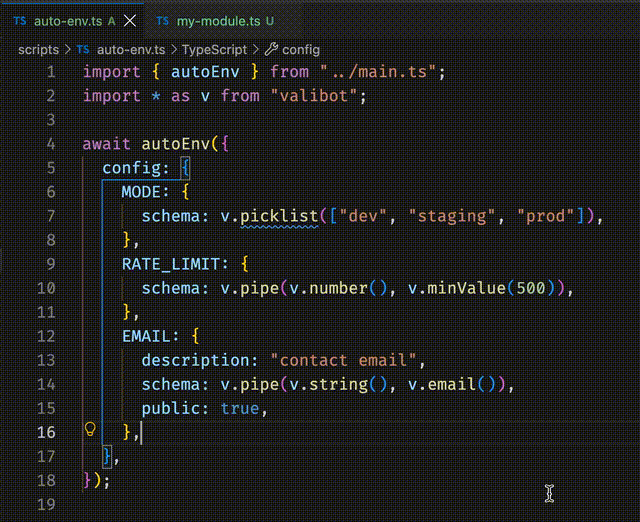

# Auto-env

Type-safe environment variables for TypeScript projects, with StandardSchema
validation, auto generation, scoping, and good defaults.

**Good defaults**

`Auto-env` lets you fall into
[the pit of success](https://blog.codinghorror.com/falling-into-the-pit-of-success/),
by handling `booleans`, `numbers` and `undefined` correctly. For example this
`.env` file is parsed as you would expect by default:

```
DEV=false
RATE_LIMIT=500
OPTIONAL=
PORT=3000
BASE=https://some-domain.com
URL="${BASE}:${PORT}/path"
```

And generates the following ts module:

```ts
// .env.private.ts

export const DEV = false;
export const RATE_LIMIT = 500;
export const OPTIONAL = undefined;
export const PORT = 3000;
export const BASE = "https://some-domain.com";
export const URL = "https://some-domain.com:3000/path";
```

In particular:

- `DEV` is parsed as a boolean, not as the string `"false"` (which is truthy)
- `RATE_LIMIT` is parsed as a number, not as the string `"500"` (try `"500"+1`)
- `OPTIONAL` is `undefined`
- `URL` is interpolated

**Type-safe**

`Auto-env` generates TypeScript modules you can alias and directly import from,
preventing typos in environment variable names, offering full type-safety and
documentation.



**Validation**

You can pass StandardSchemas to add a validation layer to your environment
variables.

```ts
import { autoEnv } from "@fcrozatier/auto-env";
import * as v from "valibot";

await autoEnv({
  config: {
    DEV: {
      schema: v.boolean(),
    },
    RATE_LIMIT: {
      schema: v.pipe(v.number(), v.minValue(500)),
    },
    EMAIL: {
      schema: v.pipe(v.string(), v.email()),
      public: true,
    },
  },
});
```

**Auto generation**

Create a simple Deno task that updates your `.env.private.ts` and
`.env.public.ts` modules whenever your `.env` file changes. See the
[Usage](#usage) example below.

**Scope**

You can configure the visibility of each variable by setting its `public`
boolean config field. By default all variables are private.

`Auto-env` generates two modules, `.env.private.ts` and `.env.public.ts`,
providing you with a strong basis for further lint rules or import checks to
increase strictness.

## Usage

1. Install: `deno add jsr:@fcrozatier/auto-env`

2. Update your `.gitignore`

`Auto-env` generates by default the files `.env.private.ts` and
`.env.public.ts`. To prevent env leak you should ignore them by updating your
`.env` rule

```diff
# .gitignore

- .env
+ .env*
```

> [!WARNING]
> Don't skip this step to avoid committing secrets

3. Create an `auto-env.ts` script where you call `autoEnv()`.

Under the hood it parses your `.env` file, validates the entries, and writes the
output to `.env.private.ts` by default

```ts
// scripts/auto-env.ts

import { autoEnv } from "@fcrozatier/auto-env";

await autoEnv();
```

3. Add a task to run script automatically whenever the `.env` file is modified

```jsonc
// deno.json

{
  // ...
  "tasks": {
    "gen:env": "deno watch --watch-hmr=.env -A scripts/auto-env.ts",
    "start": {
      "command": "deno watch -A start.ts",
      "dependencies": ["gen:env"]
    }
  }
}
```

## API
